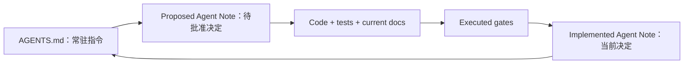

# DeepSeek Harness 如何让文档真正控制 Agent 开发

DeepSeek Harness 可复用的核心不是“多写文档”，而是把不同文档赋予不同权威，再用代码 gate 约束它们共同演化：`AGENTS.md` 给 Agent 常驻指令，architecture 和 testing 文档描述当前系统，Agent Notes 保存可被重新讨论的决定，测试和 validators 拒绝不一致的结果。人类因此可以集中处理产品与高成本决定，Agent 则在可检查的 spec 下实现、验收和维护一致性。

本文检查的上游快照是 commit [`47f943859bef60e4160492346772ded9b24f765a`](https://github.com/deepseek-ai/deepseek-harness/commit/47f943859bef60e4160492346772ded9b24f765a)，时间为 2026-08-13 19:38:46 +08:00。源码和 commit 是主证据；用户提供的 [ChatGPT 分享页](https://chatgpt.com/share/6a7ebe50-5db0-83ec-b3d3-f6b14b5549e5) 只用于定位“AGENTS → proposal → approval → implementation → tests → record”这一观察，不作为仓库事实的替代来源。

## 它建立了哪些权威层

上游根 [`AGENTS.md`](https://github.com/deepseek-ai/deepseek-harness/blob/47f943859bef60e4160492346772ded9b24f765a/AGENTS.md) 是每次工作都要看到的 standing orders。它不承担全部说明，而是把 Agent 导向 architecture、testing、子树 instructions 和具体 Agent Note；同时登记 ESM、plugin effect、session log、coverage、文档同步、非平凡变更必须带 Note 等跨仓库规则。

[`docs/AGENTS.md`](https://github.com/deepseek-ai/deepseek-harness/blob/47f943859bef60e4160492346772ded9b24f765a/docs/AGENTS.md) 进一步规定 one home per fact：当前架构放 architecture，类型和语义放 subsystem pages，决策理由放 Agent Notes，操作步骤放 cookbook，package contract 放 README，常驻命令放根 AGENTS。这个分层减少 Agent 在多个文件中复制同一事实所造成的漂移。

[`Agent Notes README`](https://github.com/deepseek-ai/deepseek-harness/blob/47f943859bef60e4160492346772ded9b24f765a/.agents/notes/README.md) 定义四个 lifecycle 位置和六种 class。`proposed` 写 Problem、Proposal、Alternatives、Acceptance criteria 和 Risks；`implemented` 改写为 Problem、Decision、Alternatives 和 Consequences，并禁止继续使用 proposal 语气；`rejected` 保留失败选择及理由；`archived` 冻结已经不再作为当前权威的历史。

因此，这些文件不是同级笔记，而是一条控制链：



## commit 历史显示了怎样的形成过程

仓库并非从第一天就拥有今天的完整制度。最初几天先建立 instructions、需求和架构，再快速补齐代码、review 修复、决策记录和质量 gate：

| 时间 | commit | 可观察变化 |
|---|---|---|
| 2026-06-10 | [`b67e81ac9`](https://github.com/deepseek-ai/deepseek-harness/commit/b67e81ac97) | 初始化 README、`AGENTS.md` 和指向它的 `CLAUDE.md` symlink。 |
| 2026-06-10 | [`804eede9e`](https://github.com/deepseek-ai/deepseek-harness/commit/804eede9eb) | 在 instructions 中先连接 MVP requirements 和 microkernel architecture。 |
| 2026-06-11 | [`cacfae3ca`](https://github.com/deepseek-ai/deepseek-harness/commit/cacfae3cae) | 完成 architecture 文档并重写 instructions。 |
| 2026-06-11 | [`217b8ec0e`](https://github.com/deepseek-ai/deepseek-harness/commit/217b8ec0e2) | 按 architecture review 修复 loop 和 service packages。 |
| 2026-06-11 | [`9b8fccc6f`](https://github.com/deepseek-ai/deepseek-harness/commit/9b8fccc6f9) | 回填 architecture decision records。 |
| 2026-06-11 | [`4dafad4db`](https://github.com/deepseek-ai/deepseek-harness/commit/4dafad4db6) | 为其余质量提案增加 RFC。 |
| 2026-06-11 | [`bfb034830`](https://github.com/deepseek-ai/deepseek-harness/commit/bfb034830f)–[`86955b96a`](https://github.com/deepseek-ai/deepseek-harness/commit/86955b96a4) | 加入 per-file coverage、hygiene、hooks 和 CI matrix。 |
| 2026-07-19 | [`e8eddc7ef`](https://github.com/deepseek-ai/deepseek-harness/commit/e8eddc7ef8) | RFC 统一改名为 Agent Notes。 |
| 2026-07-19 | [`b1b57a0ac`](https://github.com/deepseek-ai/deepseek-harness/commit/b1b57a0ac5) | 明确要求非平凡变更与 Agent Note 同 PR。 |

这段历史支持两个结论。第一，文档很早就参与架构形成，而不是产品完成后的使用说明。第二，现行制度是迭代形成的；“所有代码从第一天起都严格 proposal-first”并不符合历史，因为部分 ADR 明确是 backfill。本项目把“生产实现前完成 proposal 并取得产品批准”作为强化规则，而不是伪装成上游一直如此。

## Code Mode 提供了一个完整纵向样本

Code Mode 的 commit 链显示 proposal、review、重写、分片实现和修复如何配合：

1. [`1cc6e1caf`](https://github.com/deepseek-ai/deepseek-harness/commit/1cc6e1caf7) 先增加 Code Mode RFC；随后 [`6d9934103`](https://github.com/deepseek-ai/deepseek-harness/commit/6d9934103d)、[`1b7c376ae`](https://github.com/deepseek-ai/deepseek-harness/commit/1b7c376aec) 和 [`a1eea4d36`](https://github.com/deepseek-ai/deepseek-harness/commit/a1eea4d36e) 连续处理 concurrency、VM guard、prompt budget、alternatives 和多语言 backend 等文档 review。
2. [`376d405ba`](https://github.com/deepseek-ai/deepseek-harness/commit/376d405ba4) 把方案重写为 registry-native mode 和 worker-thread runtime seam；[`cb3246d2d`](https://github.com/deepseek-ai/deepseek-harness/commit/cb3246d2d8) 再处理 Codex review。
3. [`6da6f0401`](https://github.com/deepseek-ai/deepseek-harness/commit/6da6f04016) 交付 capability seam，[`583704ac1`](https://github.com/deepseek-ai/deepseek-harness/commit/583704ac1d) 交付 worker runtime，[`b59d245c7`](https://github.com/deepseek-ai/deepseek-harness/commit/b59d245c7c) 交付 registry、SDK codegen 和 `run_code` bridge，并把 Note 迁到 implemented。
4. [`84088300b`](https://github.com/deepseek-ai/deepseek-harness/commit/84088300bc) 继续修复 unloggable args、event copy 和 binding 安全问题。

当前实现记录位于 [`2026-06-15-code-mode.md`](https://github.com/deepseek-ai/deepseek-harness/blob/47f943859bef60e4160492346772ded9b24f765a/.agents/notes/implemented/feature/2026-06-15-code-mode.md)。这里最重要的不是 commit 数量，而是 spec 接受多轮修改后才固定关键边界；实现又按 seam、runtime、integration 形成可 review 的纵向切片，最后通过测试和后续修复收敛。

公开仓库转移后，GitHub API 对旧 PR discussion 的访问不可用，因此本文不复述不可核验的 review 对话。关于 review 内容的判断只来自 commit subject、diff 顺序和当前文件；这是 inference，不是丢失 PR 内容的直接证据。

## 规模数据说明什么，也不说明什么

可复现脚本 [`scripts/analyze_deepseek_harness.py`](../scripts/analyze_deepseek_harness.py) 对快照得到 12,293 个全部 refs commit、972 个 HEAD first-parent commit 和 6,683 个 non-merge commit。严格按 [snapshot JSON](evidence/deepseek-harness-history.json) 中的路径规则，2,028 个 non-merge commit 修改 Agent Notes，1,441 个同时修改 Agent Note 与 production path，1,508 个同时修改 Agent Note 与 test path。

这些数字证明 Note 与代码、测试存在大规模共同演化，不证明某个 Note 写在代码之前，也不证明共同修改必然提升质量。顺序需要看具体 commit 链，效果需要独立实验；因此本仓库同时保留 Code Mode 纵向样本和三组小型 A/B case。

复现命令：

```sh
git clone https://github.com/deepseek-ai/deepseek-harness.git
python3 scripts/analyze_deepseek_harness.py /path/to/deepseek-harness
```

## 新项目真正应该复用什么

应复用的是五个相互咬合的机制：

- 人类和 Agent 的 decision ownership 明确分开；批准点落在产品含义和高成本选择上。
- 非平凡工作先形成可审查 proposal，验收标准描述 observable outcome。
- instructions、current-state docs、decision record 和 tests 各有唯一权威范围。
- Agent Note 的 lifecycle 要求 proposed 与 implemented 使用不同语气和内容，而不是只改一个状态字段。
- 能机械检查的规则进入实际执行的 gate，并在交付中保留原样结果。

本仓库的 `spec-driven-development` Skill 把这五点独立出来，并补充上游历史不能证明的严格批准点、preview-by-default CLI、显式 semantic diff 分类和可复查实验协议。具体落地步骤见 [新项目采用指南](adoption-guide.md)。
