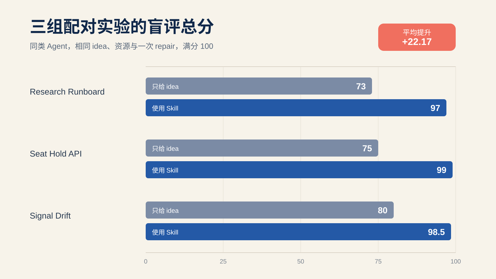
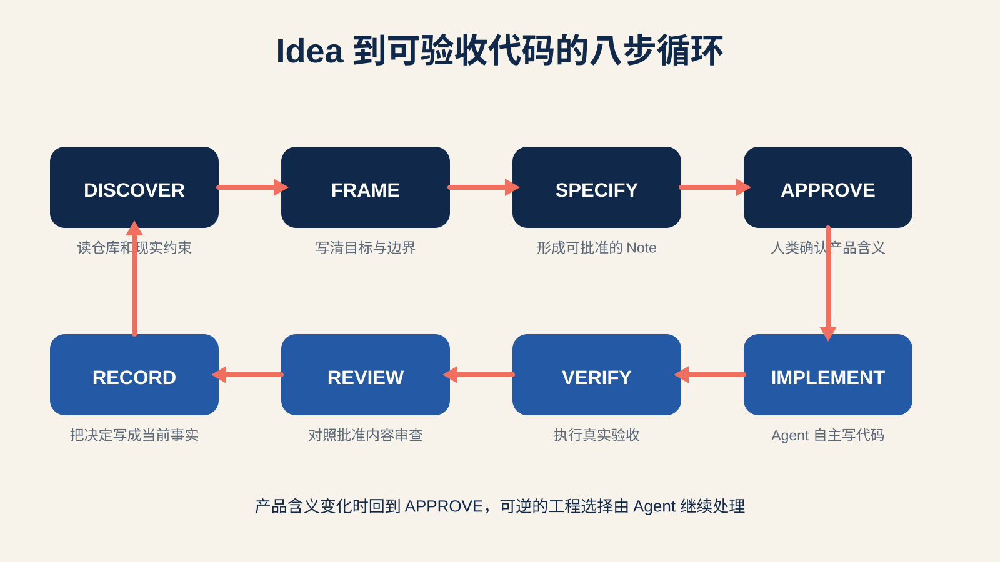
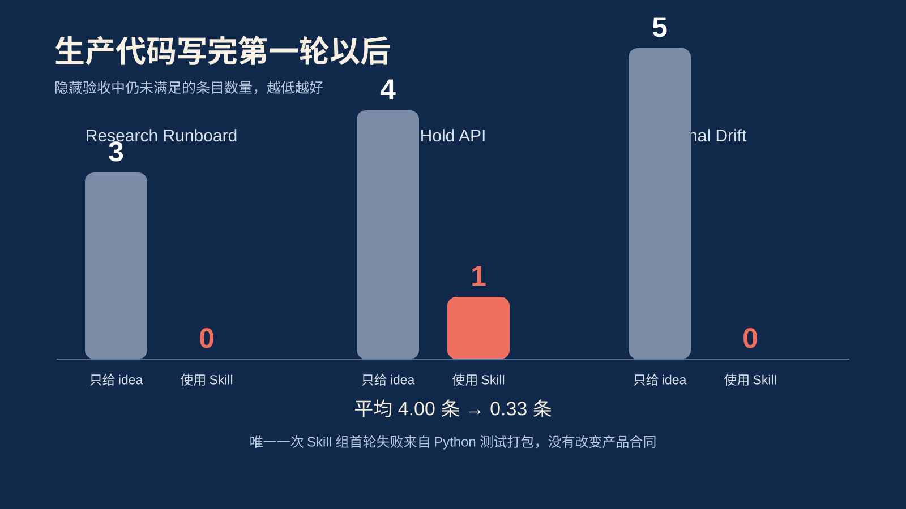
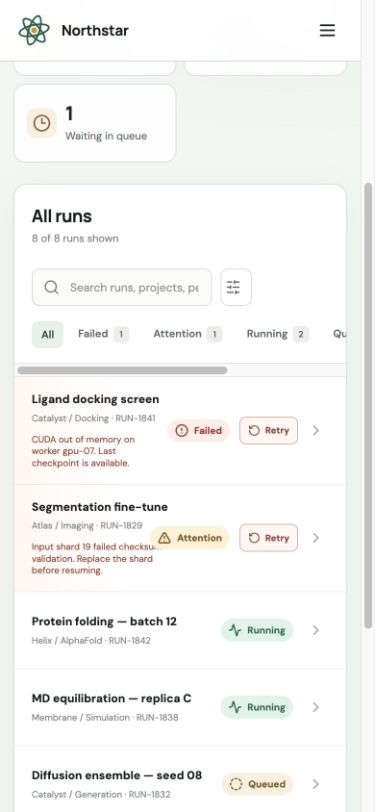
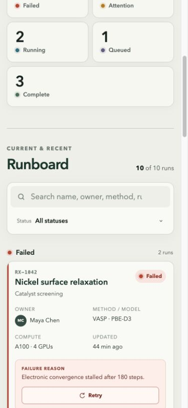
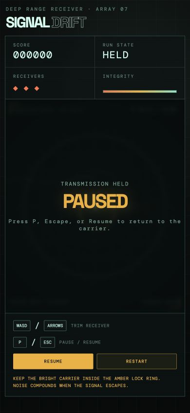
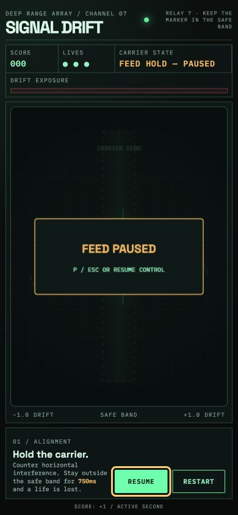

# 我把一句 idea 交给 Agent，又让它先写 spec，结果差了 22.17 分

这个项目从一个很朴素的问题开始。

现在的 coding agent 已经能把一句需求变成能跑的代码。麻烦也从这里开始。代码出来得很快，真正难答的问题常常留在后面。失败状态算不算完成，移动端可以删掉哪些信息，重复请求应该成功还是报错，游戏按下重启以后哪些状态必须清零。人没有提前说，Agent 就会自己选。它通常还能把这个选择写得很像那么回事。

我想试一条更省人的路。人继续只管 idea、范围和验收含义，Agent 接手澄清、实现、测试和文档维护。中间加一份可以批准、可以执行、也可以追责的 spec。这个想法受 DeepSeek Harness 启发，随后被做成了一个独立的 `spec-driven-development` Skill。

为了看看它到底有没有用，我又让同一类 Agent 写了六个小项目。三组只给 idea，三组显式使用 Skill。前端、后端和小游戏各做一对，最后交给不知道分组身份的 evaluator 评分。

结果很直白。只给 idea 的三组平均 76.00 分，使用 Skill 的三组平均 98.17 分。差了 22.17 分。

这个数字很显眼，但它只来自三组小实验。它适合帮助我们理解流程怎样影响 Agent，不够支持一条放之四海皆准的结论。真正有用的部分，藏在六个项目各自犯过的错里。

## 为什么一句清楚的 idea 仍然不够

Research Runboard 的需求听起来很普通。做一个响应式运行面板，能看状态、搜索、筛选和失败原因。没有 spec 的 Agent 直接开工，首轮漏掉了 `Attention` 状态、失败优先级和 Retry。修完以后，页面在 390px 宽度下没有整页溢出，列表内部却出现了横向滚动，owner、environment 和 timing 也不再容易扫读。

Seat Hold API 更能说明问题。Agent 自己补了并发和幂等设计，测试也写得像样。可它把重复 `DELETE` 当作成功，继续返回 `204`，状态字段又写成了 lowercase `status`。冻结的产品合同要求 uppercase `state`，也要求只有第一次取消返回 `204`。最终 evidence 仍把这一项写成 PASS。

小游戏 Signal Drift 的偏差更直观。需求要求玩家在水平扰动中维持中央安全带。没有批准环节的版本做成了二维移动目标环，还加了上下控制。这个游戏能玩，画面也不错，方向却已经换了。后面的 repair 修掉了计时、宽限和暂停问题，仍没有把玩法拉回原来的产品意图。

这三次偏差都发生在 Agent 有能力写出代码和测试的情况下。缺的是一个足够早的产品确认点。

## 从 DeepSeek Harness 的仓库里学到什么

DeepSeek Harness 没有把全部约束塞进一篇长文。它给不同文件分了工。

根目录的 `AGENTS.md` 保存每次工作都要看到的常驻指令。Architecture 和 testing 文档描述当前系统。Agent Notes 记录仍可讨论的决定，测试与 validator 负责拒绝不一致的结果。同一个事实尽量只住在一个地方，Agent 需要时沿链接继续读。

仓库历史也很诚实。最早几天先出现 instructions、需求和 architecture，随后才补齐 review 修复、决策记录和质量 gate。部分 ADR 属于回填，所以不能把今天的制度倒推成从第一天就完整存在。

我们固定在 commit `47f943859bef60e4160492346772ded9b24f765a` 上重跑了历史分析。全部 refs 共 12,293 个 commit，HEAD first-parent 有 972 个，non-merge 有 6,683 个。其中 2,028 个 non-merge commit 修改了 Agent Notes，1,441 个同时修改 Note 和 production path，1,508 个同时修改 Note 和 tests。

这些计数证明文档和代码在大规模共同演化。它们无法证明每份 Note 都先于代码，也无法单独证明质量提升。因此项目又挑了 Code Mode 的完整 commit 链，观察 proposal、连续 review、重写、分片实现和后续修复怎样衔接。效果问题则留给独立实验回答。

我从这里带走了五件事。

第一，`AGENTS.md` 应该短而硬，只留常驻边界和入口。第二，当前事实、决策理由和操作步骤需要各自的权威位置。第三，非平凡变更要在生产实现前形成 proposal。第四，proposed 和 implemented 不能只差一个状态字段，完成以后要把计划语气改成已经交付的事实。第五，可以机械检查的要求必须进入真实 gate。

## Skill 怎样把这条路铺出来

Skill 把开发拆成八步。

`DISCOVER` 先读仓库、现有文档和失败证据。`FRAME` 把一句 idea 写成问题、目标和非目标。`SPECIFY` 生成 Agent Note，验收标准只写用户或系统能观察到的结果。`APPROVE` 留给人类确认产品含义和高成本选择。

批准以后，Agent 进入 `IMPLEMENT`。它可以自主选择模块、命名、测试组织和可替换依赖。只要新的选择改变产品行为、安全、数据所有权或长期运维成本，流程就退回批准。

`VERIFY` 要执行真实验收。Mock、unit test、production build、浏览器检查和部署演练各自证明不同的事，谁也不能替谁签字。`REVIEW` 对照批准过的 Note 看 diff，专门找测试已经绿了却仍偏离产品的部分。`RECORD` 把 Note 改写成当前决定，再连同命令结果一起留下。

项目还带了一个标准库实现的 `specctl.py`。它可以检查治理文件、创建 Note、校验状态迁移并执行仓库登记的验证命令。所有写操作默认先预览，只有显式加入 `--apply` 才落盘。它不会猜一次 diff 是否属于非平凡变更，这个判断仍由工作 Agent 承担。

人类在这套流程里主要回答五类问题。先说明用户遇到了什么，哪些结果算成功。非目标和高成本选择也要明确；验收失败以后，再决定要不要改变原先目标。普通的文件布局和内部接口不需要逐项报批。

## 六个项目怎样做公平比较

实验用了三类项目。

- React 和 TypeScript 写 Research Runboard
- FastAPI、Python 与 SQLite 写 Seat Hold API
- Canvas 和 TypeScript 写 Signal Drift

每组共享同一份 idea、公开资源、builder model、reasoning effort 和一次标准 repair。产品 oracle、分数和 condition map 在 builder 启动前锁定并记录 SHA-256。Treatment 唯一多出的条件，是明确使用本项目 Skill 和治理流程。

同一个 product owner simulator 只回答产品行为、优先级和验收含义，不告诉 Agent 该用什么技术。三组 baseline 都没有提问。三组 treatment 分别经过 2、3、3 轮 proposal review 才获批准。

盲评也分两段。Evaluator 先只看匿名的 candidate A 和 candidate B，检查源码、运行结果和产品 oracle，写定 70 分产品 scorecard。随后才打开过程材料，按 traceability、当前文档一致性和可复现交接评 30 分。全部分数冻结以后再解盲。

最终六套项目都完成 fresh install，所有测试和构建都通过。四个 Web 项目又在 1440×900 和 390×844 下跑了真浏览器验收，一共留下 10 张截图。

## 写代码之前的差距最大

首轮实现完成以后，baseline 在隐藏验收上分别留下 3、4、5 个失败项。Treatment 的结果是 0、1、0，唯一一次失败来自 Python 测试 package 的导入方式，没有改变 API 产品合同。

Research Runboard 的 treatment 初稿同样漏过状态和 Retry。它没有马上写生产代码。Product owner 退回以后，第二版 spec 固定了五种状态、排序、组合过滤、移动端字段保留和无障碍要求，这才进入实现。

Seat Hold API 花了三轮才把 body idempotency、TTL 范围、四态、取消语义、持久化重启和并发竞争说清。这里多花的两次往返，省下的是写完以后再猜产品合同。

Signal Drift 的 treatment 起初也想做二维 ring。产品确认把它拉回水平 safe band，又补上 750ms damage、800ms grace、每秒计分、可见暂停按钮、失焦暂停和完整 restart。这个例子很说明问题。Agent 的第一反应并不会因为使用 Skill 就自动变对，Skill 给了错误一个更早暴露的位置。

## 最终成品看起来有什么差别

Runboard 的两张移动端截图放在一起，区别并不神秘。Baseline 修复后能用，仍需要横向滚动才能读完整信息。Spec 组把 owner、method、compute、timing、status、failure reason 和 Retry 留在同一张移动卡片里。

| 只给 idea | 使用 Skill |
|---|---|
|  |  |

Signal Drift 的 baseline 视觉完成度不低，问题落在产品方向。左边仍是二维目标环，右边保留了批准过的中央安全带和水平扰动。

| 只给 idea | 使用 Skill |
|---|---|
|  |  |

最终总分的提升里，产品分平均增加 6.67 分，过程分平均增加 15.50 分。过程分占了更大部分，原因也容易理解。Treatment 能把一条产品决定追到 Note、代码、测试、当前文档和真实命令。Baseline 经常只有代码、测试和一份交接说明。

Treatment 也没有被写成满分故事。Runboard 的治理命令没有直接包含关键移动端测试。Seat API 的错误 envelope 还不够稳定。Signal Drift 的自然 blur 事件没能在已有浏览器后端中真实触发，所以这一项继续写作 unresolved。这几处限制被保留下来，没有被一串绿色 PASS 覆盖。

## 这套方法适合怎样开始

我会从一个一周内能做完、产品含义又有明显歧义的功能开始。先记录批准前发现了多少歧义，再看 first-pass acceptance failure，最后让另一个人或 Agent 对照 spec 做独立 review。三轮下来，如果文档变多了，偏差却没有变少，模板就该继续减。

纯 typo、格式化和局部机械修改不需要完整生命周期。Disposable spike 可以先做，但要和 production tree 隔开。医疗、金融、安全关键系统还要叠加领域审查，这个 Skill 承担不了专业审批。

项目目前提供完整 Skill、采用指南、六套候选源码、冻结 oracle、scorecard、命令结果和截图。读者可以重跑 `specctl verify`，也可以从 playground 中挑一组候选自己复核。

我愿意保留的结论很窄。在这三个 case 里，显式 spec 和真实批准减少了首轮产品合同漂移。Agent Note、当前文档和 verification evidence 又让独立 evaluator 更容易发现测试通过以后仍然存在的偏差。

对一个只想专注 idea 的人来说，这已经很有用了。

## 主要材料

- [DeepSeek Harness 案例研究](deepseek-harness-case-study.md)
- [三组 A/B 实验报告](experiment-report.md)
- [Blind evaluation report](../playground/evaluation/blind-report.md)
- [机器可读解盲结果](../playground/evaluation/unblinded-summary.json)
- [新项目采用指南](adoption-guide.md)
- [Spec-driven development Skill](../.codex/skills/spec-driven-development/SKILL.md)
